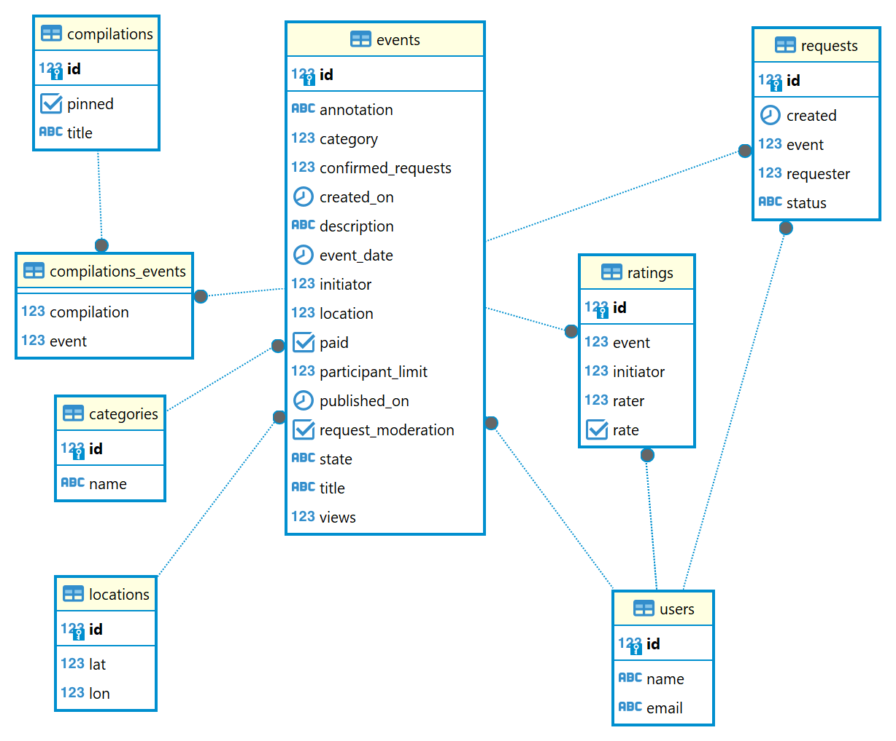
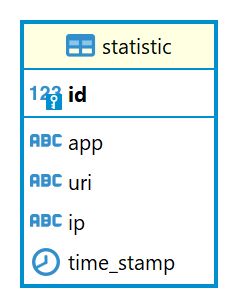

# java-explore-with-me
Template repository for ExploreWithMe project.

## Функциональность: рейтинги.   
### [Ссылка на Pull Request](https://github.com/dimapolt/java-explore-with-me/pull/3)
Описание:
В подсчёте рейтинга используется доверительный интервал биномиального распределения по методу Уилсона.  

## Эндпоинты функциональности
### Public: Оценки
**GET**: **/ratings/events** - получение всех событий, с упорядочеванием от наибольшего рейтинга к наименьшему      
**GET**: **/ratings/users** - получение всех пользователей, с упорядочеванием от наибольшего рейтинга к наименьшему
### Private: Оценки
**POST**: **/ratings/users/{userId}/events/{eventId}?mark={true/false}** - оценка от пользователя с id = userId событию с 
id = userId. true - событие понравилось, false - событие не понравилось  
**PATCH**: **/ratings/users/{userId}/events/{eventId}** - изменение оценки от пользователя с id = userId событию с id = userId. 
Найденная оценка будет инвертирована 
**DELETE**: **/ratings/users/{userId}/events/{eventId}** - удаление оценки id = userId событию с id = userId.

### Структура базы данных основного сервиса
 
### Структура базы данных сервиса статистики 
  